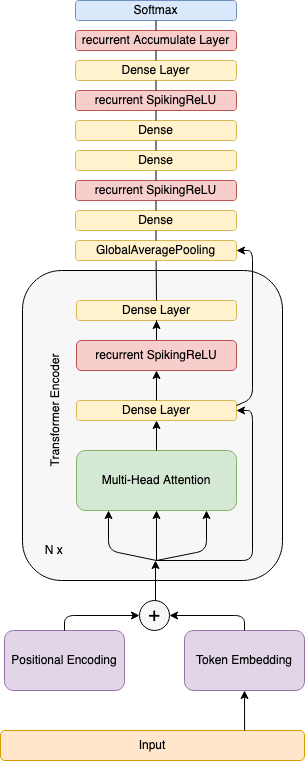
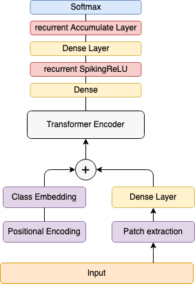

## Conversion of Analog Transformer Network to Spiking Transformer Network

In this work, we introduce the spiking architecture for self-attention-based Transformer networks obtained through weight
 conversion using weight normalization tools proposed by Rueckauer et al. (2016).

### NLP Transformer architecture

### Spiking Vision Transformer architecture

### References

Original Transformer paper::

Vaswani, A., Shazeer, N., Parmar, N., Uszkoreit, J., Jones, L., Gomez, A. N., Kaiser, L., and Polosukhin, I. (2017). Attention is all you need. CoRR, abs/1706.03762.

----

The paper is also available on arXiv: <https://arxiv.org/pdf/1706.03762.pdf>

Vision Transformer::

Dosovitskiy, A., Beyer, L., Kolesnikov, A., Weissenborn, D., Zhai, X., Un- terthiner, T., Dehghani, M., Minderer, M., Heigold, G., Gelly, S., Uszkoreit, J., and Houlsby, N. (2020a). An image is worth 16x16 words: Transformers for image recognition at scale.

----

The paper is also available on arXiv: <https://arxiv.org/pdf/2010.11929.pdf>

ANN-SNN conversion papers::

Rueckauer, B., Lungu, I.-A., Hu, Y., and Pfeiffer, M. (2016). Theory and tools for the conversion of analog to spiking convolutional neural networks.

Rueckauer, B., Lungu, I.-A., Hu, Y., Pfeiffer, M., and Liu, S.-C. (2017). Con- version of continuous-valued deep networks to efficient event-driven networks for image classification. Frontiers in Neuroscience, 11:682.

Diehl, P. U., Neil, D., Binas, J., Cook, M., Liu, S.-C., and Pfeiffer, M. (2015). Fast-classifying, high-accuracy spiking deep networks through weight and threshold balancing. 2015 International Joint Conference on Neural Networks (IJCNN), pages 1–8.
